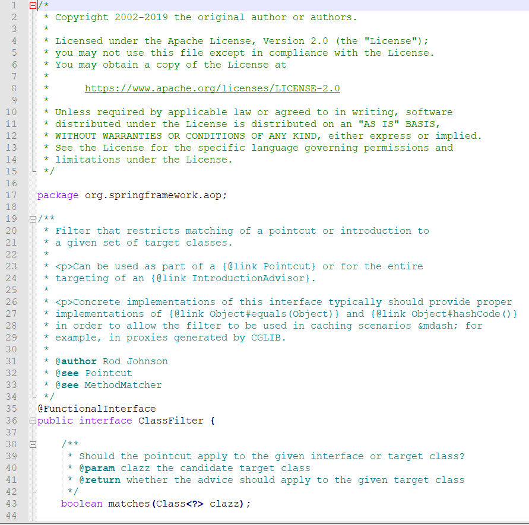
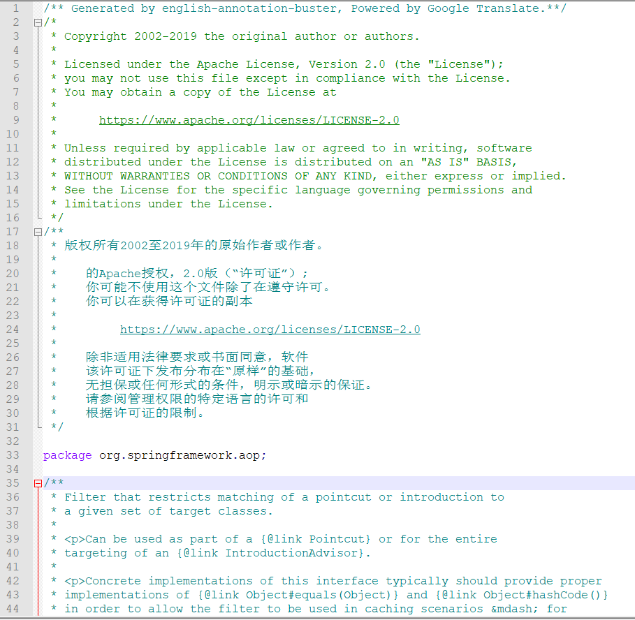

# 英语注释自动翻译助手

[](https://github.com/murphy-li/Clipboard2Voice/blob/master/LICENSE)<a href="https://996.icu"></a>

## 简介

本项目主要用于帮助大家查看源代码时将烦人的英语自动机翻为中文（使用谷歌翻译），暂时只支持Java注释：```/***/```，其他的注释如```//```或者其他语言暂时未兼容。

效果图如下：





## 运行环境

- Python 3.6+

- googletrans 2.4.0+

```bash
pip install googletrans -i https://pypi.doubanio.com/simple/
```

## 使用方法

```bash
python3 main.py project_root_dir
```

## 待完善
- 其他注释支持

- 想用正则匹配注释，但是匹配了怎么替换文本？

- ~~python多线程令人头痛~~

- 每个注释发起一个翻译请求，一个请求握手挥手就很多次，非常浪费资源


## 贡献者

- murphy-li

- Downstream1998

## License

本软件使用[](https://github.com/murphy-li/Clipboard2Voice/blob/master/LICENSE). 看这里[LICENSE](LICENSE) 获取更多细节。
